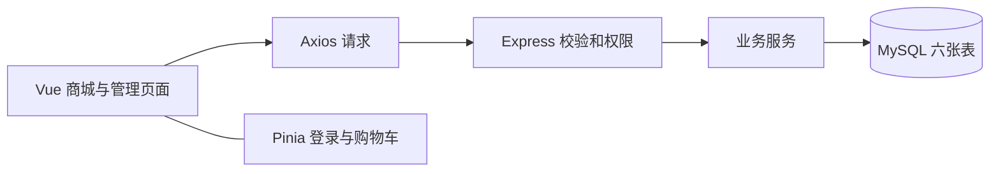
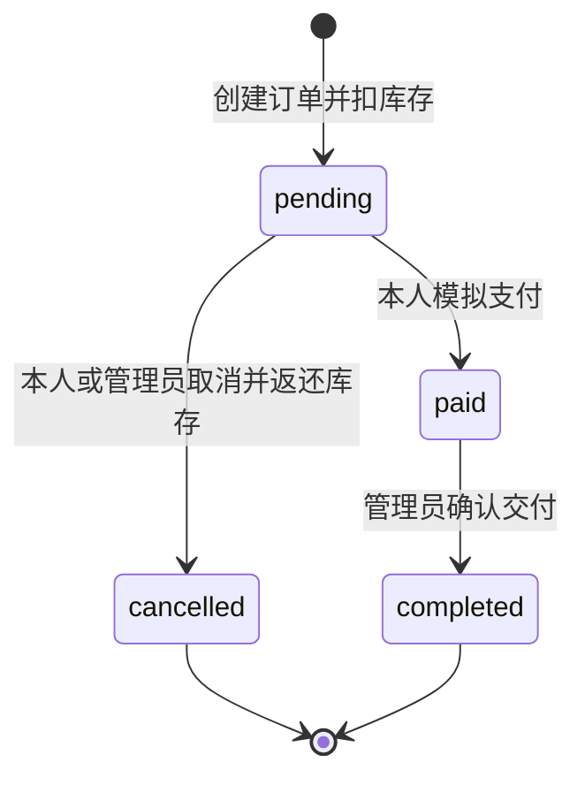

# 游戏装备商城系统单人项目设计

本方案以一个人完成课程开发、测试、文档和答辩为前提。第一版围绕游戏装备浏览、购买和交付形成完整流程，优先保证数据正确和页面可用；基础验收通过后，再选择少量视觉或交互扩展。任务书仅作参考，明显错误和无关内容直接忽略，具体功能按游戏场景与单人开发规模确定。本文描述完整设计；当前工程基础、认证与装备浏览已接入，具体范围与验证状态见[第三阶段记录](06-stage-three.md)。

## 1 项目定位

项目定位为虚构世界中的游戏装备商城。用户购买装备时填写游戏角色名和服务器，支付采用模拟操作，管理员完成模拟交付。系统不连接真实游戏账户或支付平台。

商城出售平台统一管理的装备，同一种装备可以有多件库存，各件使用相同的品阶和固定属性。第一版不设置玩家卖家、二手交易、拍卖、聊天、物流地址或真实兑换码系统。主要开发内容为用户、装备、购物车、订单和模拟交付。

默认采用整车结算：批量勾选用于删除购物车条目，结算时提交整个服务器购物车。成功创建订单后，用户可以继续支付或取消订单。

## 2 功能范围

| 模块 | 第一版必须完成 | 验收结果 |
| --- | --- | --- |
| 认证和权限 | 注册；用户名或邮箱登录；JWT；刷新保留登录；退出；游客、用户、管理员权限 | 两类账号能进入各自页面，接口阻止越权 |
| 装备列表 | 带图列表；名称搜索和防抖；稀有度多选；分类筛选；价格和稀有度排序；8、12、16 条分页 | 筛选与分页都来自服务器，能显示总条数，刷新与详情返回保留查询 |
| 装备详情 | 名称、描述、图片、价格、攻击、防御、稀有度、库存；数量选择；加入购物车 | 不可购买下架或售罄装备，数量不超过库存 |
| 购物车 | 添加和累加；改数量；单删、批删、清空；金额；游客本地保存；登录合并 | 刷新不丢数据，合并与库存调整有明确反馈 |
| 订单 | 兑换信息；确认摘要；创建；模拟支付；历史与详情；状态和时间筛选；分页；待支付取消 | 浏览到管理员完成订单的流程全部可操作 |
| 装备管理 | 搜索筛选分页；新增编辑；上下架；软删除；独立库存调整 | 普通用户无法调用管理接口，历史订单不受编辑影响 |
| 用户管理 | 用户名或邮箱搜索；分页；冻结解冻；详情及历史订单 | 冻结账户不能继续使用受保护接口 |
| 订单管理 | 所有订单；按用户、状态和时间筛选；详情；取消待支付订单；完成已支付订单 | 状态转换合法，取消库存仅返还一次 |
| 交付 | 初始化与种子数据；启动说明；接口文档；测试记录；总结；带语音演示视频 | 能从空数据库复现演示流程 |

基础版保留商品总额、优惠和订单应付金额三个字段，优惠为 0；付款后页面将已支付金额标为实付。满减属于可选扩展，不计入基础版完成条件。

基础完成后优先考虑两个小扩展：低库存提醒和两件装备属性对比。满减、飞入动画、订单 CSV 导出可以按剩余时间替换选择。评价、优惠券、统计看板、完整请求幂等、库存版本号、超时自动取消、库存流水、退款和 WebSocket 暂时后置。

## 3 角色与权限

| 操作 | 游客 | 普通用户 | 管理员 |
| --- | --- | --- | --- |
| 浏览在售装备与详情 | 可以 | 可以 | 可以 |
| 本地购物车 | 可以 | 登录后使用服务器购物车 | 不合并游客购物车 |
| 服务器购物车和下单 | 登录后 | 仅自己的购物车 | 不开放 |
| 查看、支付、取消个人订单 | 登录后 | 仅本人，且状态合法 | 通过管理入口查看和处理 |
| 管理装备、用户、全部订单 | 不可以 | 不可以 | 可以 |

管理员与普通用户使用不同账号。注册只能创建普通用户，管理员由种子脚本创建。第一版只提供冻结普通用户，不提供角色修改、删除用户或冻结管理员。

前端路由守卫用于跳转和提示；后端认证中间件负责真正的权限校验。每次受保护请求都验证 JWT，并查询用户当前角色和状态。冻结生效后的新请求返回 403，不能仅在登录时检查冻结状态。正在执行的请求按其事务结果结束。

## 4 技术架构

| 部分 | 选型 | 在本项目中的职责 |
| --- | --- | --- |
| 前端框架 | Vue 3 和 Vite | 页面与组件，开发预览和构建 |
| 路由 | Vue Router | 公共、用户和管理页面路由 |
| 共享状态 | Pinia | 登录状态、购物车、合并状态 |
| 请求 | Axios | 请求入口、Token、统一错误处理 |
| 组件 | Element Plus | 表单、表格、对话框、分页、提示 |
| 后端 | Node.js 和 Express | REST API、校验、权限、业务流程 |
| 数据库 | MySQL 和 mysql2 | 参数化 SQL、连接池、事务、六表关系 |
| 认证 | JWT 和 bcrypt | 登录凭证验证，密码以 10 轮 bcrypt 哈希保存 |
| 开发语言和依赖 | JavaScript ES Modules 和 npm | 减少单人初期维护负担；依赖版本用锁文件固定 |

前后端是两个独立运行的应用，放在同一个仓库。用户端和管理端属于同一个 Vue 应用，分别使用商城布局和管理布局。后端采用一个 Express 服务，按业务模块划分文件。



Pinia 只保存跨页面状态；搜索表单、分页和编辑对话框优先留在页面内。Vue 官方文档也将 Pinia 作为新应用的状态管理建议。[Vue 状态管理文档](https://vuejs.org/guide/scaling-up/state-management.html)

后端采用 route → controller → service 的简单分工：route 配置校验与权限；controller 接收请求和返回响应；service 实现业务并调用数据库。简单 SQL 可以放在模块 service 内，暂不增加通用仓储、微服务、消息队列、Redis 或复杂权限系统。

首次搭建时确认 Express 与实际 Node 版本兼容，固定可运行依赖组合；不在设计阶段假定所有依赖的具体版本。[Express 官方 FAQ](https://expressjs.com/en/starter/faq/)

## 5 目录设计

下面是整体目标结构，已创建的模块和后续规划目录按开发阶段逐步补齐。

```text
game_store/
  client/
    public/images/equipments/
    src/
      api/                  认证、装备、购物车、订单、管理请求
      components/           装备卡片、稀有度标签、数量选择、订单明细
      layouts/              StoreLayout、AdminLayout
      views/                auth、store、cart、orders、admin
      router/
      stores/               auth、cart
      utils/                金额显示、日期显示、输入辅助
      styles/
  server/
    src/
      app.js
      server.js
      config/               环境配置和数据库连接池
      middleware/           认证、角色、参数校验、错误处理
      modules/              auth、equipments、cart、orders、admin
      utils/                事务辅助、金额校验、业务错误
    tests/                  关键接口和事务集成测试
    .env.example
  database/
    schema.sql
    seed.js
  docs/
    01-project-design.md
    02-data-and-api.md
    03-development-plan.md
  README.md
  .gitignore
```

初期只维护本地开发环境。前端开发服务器代理 `/api` 到后端，后端连接本地数据库。验收时至少具备本地可重复启动方式。若需要部署，前端构建产物和后端可通过同一站点访问，API 保留 `/api` 前缀；不把云服务器购买和域名申请设为基础要求。

装备图片优先使用项目内固定静态资源，新建装备时从预置图片中选择或填写本站图片路径，支持预览及失败占位图。第一版不开发上传服务。替换图片使用新文件名，历史订单仍引用原文件，软删除装备时不移除旧图片资源。

## 6 页面与交互设计

| 页面或入口 | 路由 | 主要内容 |
| --- | --- | --- |
| 登录 | `/login` | 用户名或邮箱、密码、登录后返回原站内页面 |
| 注册 | `/register` | 用户名、邮箱、密码和确认密码 |
| 我的账号 | `/account` | 已实现的受保护入口，展示当前用户名、邮箱、角色、状态和注册时间 |
| 商城首页 | `/` | 顶部导航、简介、筛选栏、装备卡片、分页 |
| 装备详情 | `/equipments/:id` | 左侧图片，右侧价格、属性、库存、数量和购买操作 |
| 购物车 | `/cart` | 条目、数量、批量删除、清空、金额、去结算或登录 |
| 订单确认 | `/order/confirm` | 整车摘要、角色名、服务器、备注、提交 |
| 订单结果 | `/order/result?orderId=...` | 向后端查询实际状态，展示支付成功或继续处理入口 |
| 我的订单 | `/orders` | 状态和日期筛选、分页、详情、支付和取消 |
| 订单详情 | `/orders/:id` | 快照明细、兑换信息、金额、时间、当前可用操作 |
| 装备管理 | `/admin/equipments` | 表格、筛选、新增编辑对话框、库存调整、软删除 |
| 用户管理 | `/admin/users` | 搜索、分页、冻结解冻、用户详情抽屉及历史订单 |
| 订单管理 | `/admin/orders` | 筛选和分页、详情抽屉、取消或完成操作 |

另外提供 403 和 404 提示页。管理端详情通过抽屉复用订单明细组件，不为每个表单增加独立页面。所有异步页面提供加载、空数据、失败重试三个状态。

当前实现保留已有目录的视觉、文案、布局和配色，仅加入登录/注册或用户名/退出导航以及必要认证表单。用户已明确 UI 后期自行调整，下述视觉方案作为可调整的方向，不在当前阶段重设计页面。管理布局和完整管理页面尚未实现，现有 `/api/admin/me` 只用于权限核验。

用户端采用深色游戏商城风格，主体使用深灰或深蓝，装备图片和稀有度构成视觉重点。本项目将 SSR、SR、R、N 分别展示为传说、史诗、稀有、普通，使用金色 `#FFD700`、紫色 `#9B59B6`、蓝色 `#3498DB`、白色 `#FFFFFF`；标签保留等级代码和文字，N 标签配深色底。后台采用清晰的 Element Plus 表格和表单布局。

详情按物品类型突出有意义的信息：武器突出攻击、护甲突出防御、饰品展示已有属性与效果说明，消耗品突出用途和使用效果描述。没有属性的项目不强行显示“攻击 0、防御 0”；初期效果以描述文本展示，不增加战斗结算系统。

桌面端优先保证演示效果，商城卡片在窄屏换行、表单和结算按钮保持可操作，后台表格允许横向滚动。首版不投入复杂动效、3D 场景和完整游戏世界观制作。

搜索建议防抖 300 毫秒，改变筛选或排序后回到第一页；请求较慢时只采用最后一次搜索结果。筛选条件写入路由查询参数，便于从详情返回时保持列表位置与条件。

售罄装备仍保留卡片和详情入口，图片适度减弱并显示“暂时售罄”，仅禁用加购与购买。用户仍可了解装备属性和用途。下架或软删装备在公共详情接口返回 404。

## 7 核心业务规则

### 7.1 认证

用户名和邮箱分别唯一。注册时去除用户名两端空白，用户名为 2–20 个 Unicode 字符，不允许 `@` 或空白字符；邮箱去除两端空白并转小写，最多 50 个字符。密码至少 8 个字符、UTF-8 编码最多 72 字节，不能自动去除两端空白。注册只接受用户名、邮箱、密码，普通用户与空购物车在同一事务创建；确认密码仅在前端校验。数据库唯一索引处理并发重复注册，服务端不返回密码哈希。

JWT 默认有效期为 2 小时，通过环境变量配置，签名使用至少 32 字节的随机密钥。Token 保存在 localStorage，应用启动时仅在已有 Token 的情况下调用 `/api/auth/me` 确认身份，路由守卫等待验证结束；不能只凭本地 Token 存在就显示已登录。网络或服务器失败时保留 Token，但不显示已验证身份，提供重新验证与退出入口。

当前受保护请求返回 401 时清理登录状态并跳转登录页；登录凭证错误的 401 留在表单提示。账号冻结 403 清理身份并提示，普通权限不足 403 进入无权限页。登录返回地址只接受本站路径，拒绝外站、协议相对地址、反斜杠及登录/注册循环。已登录用户访问登录或注册页会返回安全目标页面。

跨标签页通过 storage 事件同步登录和退出。恢复请求及错误响应只允许作用于仍然匹配的 Token 和身份版本，防止旧请求在退出或切换账户后重新恢复原身份。同页只允许最新登录请求生效，离开登录/注册页后旧请求不再自行导航。登录/注册提交期间禁止重复提交，并展示具体字段错误。

当前退出会清除 Token 和用户状态，同时调用退出接口确认操作；即使服务器暂时不可用，本地退出仍生效。购物车模块实现后还需清除内存中的登录购物车，保留服务器购物车。第一版不建设 Token 撤销名单，因此已有 Token 的服务器有效期由其到期时间和账户状态决定；每次受保护请求查询数据库，冻结后的后续请求立即被拒绝。管理员种子密码、数据库密码和 JWT 密钥通过本地环境配置，不提交到仓库。

### 7.2 购物车

游客在 localStorage 保存装备 ID 和数量，价格与可用性每次从服务器重新获取。登录为普通用户后，将本地购物车合并到服务器：同装备数量相加；最终数量不超过当前库存与应用数量上限中的较小值；本地的下架、软删或售罄装备不加入，并返回原因。

服务器已有失效条目在读取时明确标记，用户可删除；不得静默结算。合并涉及的已有失效条目也返回失效提示，保留服务器原条目供用户处理。所有成功的修改返回最新购物车，前端用返回结果更新，避免累加两次。

合并完成前禁用服务器购物车写入和结算。只有明确收到成功响应才清除本地待合并条目。响应超时则保留本地数据并记录“结果待核对”，该记录绑定目标用户 ID 和本次本地条目副本；刷新后不自动重新累加，切换账号也不把待核对副本并入另一个账号。页面显示目标账号的服务器购物车，用户核对后可确认清除该本地副本，再手动调整服务器数量。这是基础版的失败处理，完整合并请求去重属于后续扩展。

管理员登录不触发合并。退出普通账号后不把服务器购物车复制为游客购物车，避免下次登录重复合并。登录状态失效时先提示重新登录，不直接把账号购物车写回游客存储。

购物车不预占库存。金额由服务器价格计算，前端即时计算仅用于展示；有失效装备或数量超过库存时，明确标记并要求处理后结算。

### 7.3 创建订单

角色名去除两端空白后为 2–10 个 Unicode 字符；服务器必选；备注最多 200 字。初期预置三个虚构服务器选项，在前后端使用同一组取值。

确认页刷新服务器购物车。提交时包含装备 ID、数量和确认时单价，用于检测内容或价格变化。服务器以数据库为准计算金额；如果购物车内容、数量或单价已变化，返回 409，要求重新确认，不能按过期金额悄悄成交。

创建订单时，在同一数据库连接和事务中完成购物车校验、装备状态校验、库存扣减、订单写入、快照写入和购物车清空。任一步失败全部回滚。购物车修改与结算使用相同的购物车行锁，防止另一页面新增的商品被误清空。

库存表示可售数量，在创建 `pending` 订单时扣减。支付时不再次扣库存；取消待支付订单时返还。使用事务内锁定读取协调库存操作，不能仅依赖前端禁用按钮。MySQL 官方文档说明了 `FOR UPDATE` 在事务中的锁定行为。[MySQL 锁定读取文档](https://dev.mysql.com/doc/refman/8.4/en/innodb-locking-reads.html)

### 7.4 订单状态



| 状态 | 页面显示 | 允许操作 |
| --- | --- | --- |
| `pending` | 待支付 | 本人支付；本人或管理员取消 |
| `paid` | 已支付，待交付 | 管理员标记完成 |
| `cancelled` | 已取消 | 查看详情 |
| `completed` | 已完成 | 查看详情 |

第一版不允许把已支付订单取消，避免产生没有退款记录的状态。支付和取消必须锁定同一订单并重新验证状态，同时发生时只有一种转换生效。重复取消不再返还库存，重复支付不重复处理。

未支付订单在第一版持续占用库存，由用户继续支付或取消，也可由管理员取消；不展示尚未实现的 15 分钟自动关闭倒计时。模拟支付不随机制造失败，失败来源是请求或状态处理异常，页面以服务器实际状态为准。

订单保存名称、图片路径、稀有度、单价和数量快照。装备改价、改名、下架或软删后，历史订单仍显示成交时信息。待支付订单付款也沿用其已确认金额，不重新按现价计费。

### 7.5 管理操作

装备普通编辑不携带库存字段。库存调整用独立“增加 N 件／减少 N 件”操作，并检查结果不小于 0，避免旧编辑表单把用户下单后的库存覆盖回旧值。

装备删除采用 `status=deleted`，关联 `pending` 或 `paid` 订单时阻止软删除；下架可立即停止新购买，已有订单仍可继续处理。取消订单即使遇到下架装备也按原数量返还库存。用户和订单不提供物理删除入口。

管理员处理订单复用普通订单的状态规则和取消服务，不能另写一个直接修改任意状态的接口。

## 8 产品规则与调整原则

任务书提供初始思路，最终实现以当前设计为准。明显的模板遗留、类型混用和自相矛盾内容直接按项目需要处理。后续调整同时考虑游戏场景是否合理、用户操作是否清晰、数据能否保持正确，以及单人开发工作量。

| 场景 | 当前产品规则 | 目的 |
| --- | --- | --- |
| 游客挑选装备 | 可加入本地购物车，登录后合并并下单 | 保留浏览时的购买意向 |
| 装备暂时售罄 | 可浏览详情，禁用加购和购买 | 库存状态不妨碍了解装备 |
| 虚拟商品兑换 | 填写角色和服务器，由管理员模拟交付 | 与游戏装备的交付对象对应 |
| 付款与交付 | 支付后为待交付，管理员交付后为已完成 | 分别记录付款和履约进度 |
| 取消待支付订单 | 取消与返还库存同时完成且只执行一次 | 释放未成交订单占用的库存 |
| 金额展示 | 存储用整数分；付款前显示应付，付款后显示实付 | 避免金额计算和付款状态歧义 |
| 初始装备内容 | 准备 16 件装备，覆盖品阶、类型、属性与不同库存状态 | 支持真实浏览体验和完整演示 |

游戏内容和交互可以继续细化。若增加新的交易方式或交付流程，应同步调整数据模型、接口和验收用例，并重新评估工作量。

## 9 设计完成和实现完成的区别

工程基础、六表、演示数据、只读目录及第二阶段认证功能已实现。购物车、订单、完整后台、装备搜索与详情、正式素材和演示视频仍需按阶段补齐。自动测试、构建和浏览器操作分别记录，本阶段尚未完成浏览器点击验收，不能把功能已实现或自动测试通过等同于页面流程全部通过。最新结果见[第二阶段记录](05-stage-two.md)。

参考资料：[游戏装备商城系统.docx](/Users/jiangwannuo/Downloads/游戏装备商城系统.docx)。文档中的示例不作为必须原样实现的约束。
