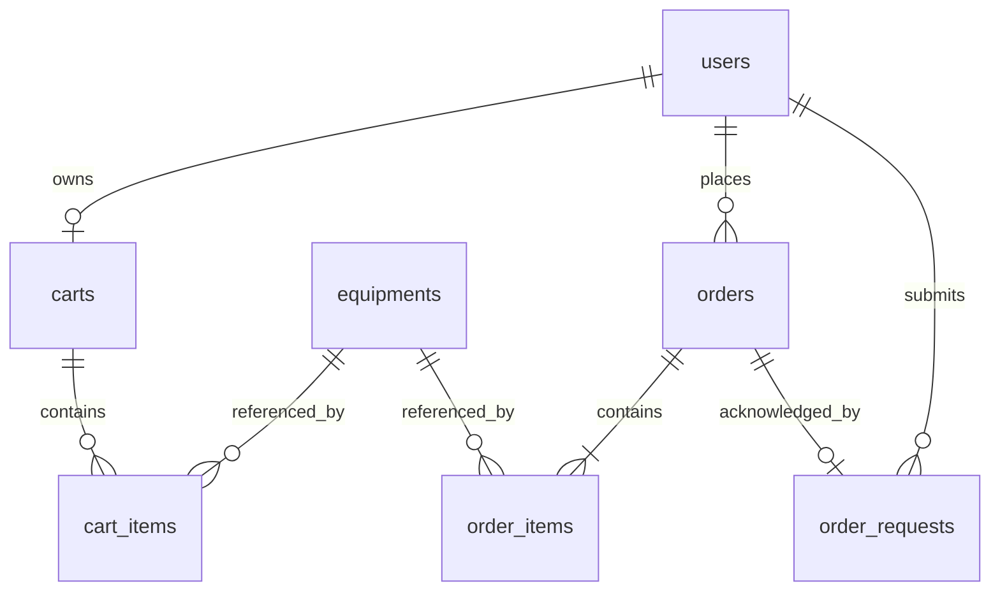

# 游戏装备商城数据库与接口设计

本文件是单人基础版的整体实现约定，配合项目设计使用。任务书中的字段和接口仅作参考，本文件按当前产品规则统一定义。六表、健康检查、元数据、认证权限，以及装备搜索筛选分页和公开详情已接入。购物车 CRUD、原子批删和登录合并已接入；普通用户订单已实现，完整后台仍为后续设计，当前验证状态见[第五阶段记录](08-stage-five.md)。

## 1 数据库通用约定

采用 MySQL、InnoDB 和 utf8mb4。六张业务表的主键均为自增 `INT UNSIGNED`，外键使用相同类型。数据库保存 UTC 时间，API 返回带 `Z` 的 ISO 8601 时间，页面转换为本地时间。

所有金额字段均为整数分，例如 `price=12900` 表示 129 元。基础版 `discount=0`，`actual_total=total-discount`。SQL 不使用浮点金额，接口不能把展示字符串 `129.00` 当成存储金额。

为使边界明确，首版应用校验暂定单件价格为 1–1000000 分，可售库存为 0–9999 件，单项购买数量为 1–9999，购物车最多 100 种装备，订单总额不超过 100000000 分。这些是可调整的项目限制，并非任务书额外要求。库存扣减和返还仍以非负、数据库类型范围和实际占用数量为准：取消必须允许归还此前已占用库存，即使返还后超过新增库存表单的 9999 件上限。

数据库唯一约束和外键负责基本一致性，服务端校验长度、枚举、数量和金额边界。第一阶段已在 MySQL 9.4.0 验证数量与金额等 CHECK 约束实际生效，初始化要求 MySQL 8.0.16 或更新版本；后续写接口仍须进行服务端校验。

## 2 实体关系



普通用户注册时在同一事务中创建空购物车；管理员不创建购物车。装备只有软删除，历史订单和用户记录保留。外键默认限制物理删除，首版不提供删除用户、订单的接口。

### 2.1 users 用户表

| 字段 | 类型 | 约束和用途 |
| --- | --- | --- |
| id | INT UNSIGNED | 主键，自增 |
| username | VARCHAR(20) | 必填，唯一；2–20 字，禁用 `@` 和空白字符 |
| email | VARCHAR(50) | 必填，唯一；去空白、转小写并校验格式 |
| password_hash | VARCHAR(60) | 必填，bcrypt 10 轮哈希，任何 API 都不返回 |
| avatar | VARCHAR(500) | 可空，使用默认头像，不开发上传 |
| role | ENUM('admin','user') | 默认 user，注册不可指定管理员 |
| status | ENUM('active','frozen') | 默认 active |
| created_at | DATETIME | 必填，注册时间 |
| updated_at | DATETIME | 必填，最后修改时间 |

唯一索引为 `username`、`email`，采用一致的不区分大小写比较规则。密码字段使用 `password_hash`，明确只存哈希。原始密码最少 8 个字符、UTF-8 编码最多 72 字节，不自动去除密码两端空白；前后端采用一致规则。

### 2.2 equipments 装备表

| 字段 | 类型 | 约束和用途 |
| --- | --- | --- |
| id | INT UNSIGNED | 主键，自增 |
| name | VARCHAR(50) | 必填，去两端空白后 1–50 字 |
| price | INT UNSIGNED | 必填，单价，单位为分 |
| rarity | ENUM('SSR','SR','R','N') | 必填 |
| category | ENUM('weapon','armor','accessory','consumable') | 武器、护甲、饰品、消耗品 |
| image | VARCHAR(500) | 必填，本站静态图片路径 |
| attack | INT UNSIGNED | 默认 0，攻击属性 |
| defense | INT UNSIGNED | 默认 0，防御属性 |
| new_until | DATETIME | 可空，UTC 新品展示截止时间；服务端计算 is_new |
| series_code | VARCHAR(64) | 可空，系列标识；日蚀圣械为 eclipse_relics |
| description | VARCHAR(500) | 可空，纯文本，不渲染用户 HTML |
| stock | INT UNSIGNED | 默认 0，当前可售库存，不包含已下单占用数量 |
| status | ENUM('on_sale','off_sale','deleted') | 默认 off_sale，新建时可明确选择上架 |
| created_at | DATETIME | 必填 |
| updated_at | DATETIME | 必填 |

初始索引采用 `(status, created_at, id)` 和 `(status, category, rarity)`。数据量较小时名称包含搜索使用参数化 LIKE；不假定普通 B-tree 索引能加速任意包含匹配。稀有度排序使用显式等级 SSR、SR、R、N，排序字段通过白名单映射 SQL，不拼接用户提供的列名。

### 2.3 carts 购物车表

| 字段 | 类型 | 约束和用途 |
| --- | --- | --- |
| id | INT UNSIGNED | 主键，自增 |
| user_id | INT UNSIGNED | 必填，外键 users.id，唯一 |
| updated_at | DATETIME | 必填，购物车内容最后修改时间 |

独立购物车表记录所属用户和更新时间，并作为购物车写操作和整车结算的锁定对象。所有写入操作都先锁定该用户的购物车记录。

### 2.4 cart_items 购物车明细表

| 字段 | 类型 | 约束和用途 |
| --- | --- | --- |
| id | INT UNSIGNED | 主键，自增 |
| cart_id | INT UNSIGNED | 必填，外键 carts.id |
| equipment_id | INT UNSIGNED | 必填，外键 equipments.id |
| quantity | INT UNSIGNED | 必填，正整数 |
| created_at | DATETIME | 必填 |
| updated_at | DATETIME | 必填 |

建立 `(cart_id, equipment_id)` 唯一索引和 `equipment_id` 索引，同一购物车同装备只保留一行。此表不保存成交价格，读取时关联当前装备信息；购物车中的数量不代表库存承诺。

### 2.5 orders 订单表

| 字段 | 类型 | 约束和用途 |
| --- | --- | --- |
| id | INT UNSIGNED | 主键，自增，用于 API 路径 |
| order_no | VARCHAR(24) | 必填，唯一，对用户展示 |
| user_id | INT UNSIGNED | 必填，外键 users.id |
| total | INT UNSIGNED | 必填，商品金额合计，分 |
| discount | INT UNSIGNED | 默认 0，优惠金额，分 |
| actual_total | INT UNSIGNED | 必填，订单应付金额，分 |
| character_name | VARCHAR(10) | 必填，2–10 个 Unicode 字符 |
| server | VARCHAR(20) | 必填，服务器代码，取值见元数据 |
| remark | VARCHAR(200) | 可空 |
| status | ENUM('pending','paid','cancelled','completed') | 默认 pending |
| payment_time | DATETIME | 可空，支付成功时设置 |
| cancelled_at | DATETIME | 可空，取消时设置 |
| completed_at | DATETIME | 可空，管理员完成时设置 |
| created_at | DATETIME | 必填 |
| updated_at | DATETIME | 必填 |

建立 `order_no` 唯一索引、`(user_id, created_at, id)`、`(status, created_at, id)` 索引。订单号可采用 14 位 UTC 日期时间与 10 位随机字符，唯一冲突时有限次重建，不依赖时间戳单独保证唯一。

`actual_total` 表示扣除优惠后的订单金额，在待支付状态显示为应付金额，只有支付成功后才展示为实付。页面不得将待支付订单描述为已经付款。

### 2.6 order_items 订单明细表

| 字段 | 类型 | 约束和用途 |
| --- | --- | --- |
| id | INT UNSIGNED | 主键，自增 |
| order_id | INT UNSIGNED | 必填，外键 orders.id |
| equipment_id | INT UNSIGNED | 必填，外键 equipments.id，便于库存返还和追溯 |
| equipment_name | VARCHAR(50) | 必填，名称快照 |
| equipment_image | VARCHAR(500) | 必填，图片路径快照 |
| rarity | ENUM('SSR','SR','R','N') | 必填，稀有度快照 |
| price | INT UNSIGNED | 必填，成交单价快照，分 |
| quantity | INT UNSIGNED | 必填，正整数 |

建立 `(order_id, equipment_id)` 唯一索引和 `equipment_id` 索引。一笔订单至少一行明细，由创建订单事务保证；行小计直接由 `price × quantity` 计算，不额外保存。

### 2.7 重试记录表

`cart_merge_receipts` 保存游客合并批次、账号、规范化请求摘要及调整结果，详见购物车接口。

`order_requests` 保存订单创建请求：

| 字段 | 类型 | 用途 |
| --- | --- | --- |
| request_id | CHAR(36) ASCII，区分大小写 | 全局主键，应用规范化为小写 UUID v4 |
| user_id | INT UNSIGNED | users 外键，来自已验证身份 |
| payload_hash | CHAR(64) ASCII | 规范化请求 SHA-256，禁止同编号换内容 |
| order_id | INT UNSIGNED，可空、唯一 | orders 外键；事务内占位后关联新订单 |
| created_at | DATETIME | 创建时间 |

占位、订单和关联一起提交；失败全部回滚，不会留下已提交的空关联。两种记录当前均不自动过期，以免延迟重试再次执行。已有数据库执行 `npm run db:init` 补建，保留业务数据。

## 3 API 通用约定

接口以 `/api` 开头，JSON 字段统一使用 snake_case。认证头为 `Authorization: Bearer <token>`。受保护接口先验证身份和账户状态，再验证角色与资源归属。自己的订单以 `id + user_id` 查询，不信任请求体中的用户 ID；管理员使用独立入口。

```json
{
  "code": 0,
  "message": "success",
  "data": {
    "items": [],
    "page": 1,
    "page_size": 12,
    "total": 0
  }
}
```

列表 `total` 指条目总数，不是金额。普通成功返回 HTTP 200，注册和订单创建、新建装备返回 201；删除成功也返回 JSON，避免混用空响应。列表包含 `items/page/page_size/total`，详情返回对象。金额字段在所有接口中均为分。

| HTTP 状态 | code | 使用场景 |
| --- | --- | --- |
| 200 或 201 | 0 | 成功 |
| 422 | 10001 | 格式、范围、未知枚举、重复用户名或邮箱等校验失败 |
| 401 | 10002 | 未登录、无效或过期 Token、登录凭证错误 |
| 403 | 10003 | 角色权限不足 |
| 403 | 10006 | 账号被冻结 |
| 404 | 10004 | 不存在或无权访问的个人订单、不可公开访问的装备 |
| 409 | 10005 | 库存不足，附装备 ID 和当前库存 |
| 409 | 10007 | 确认的单价或购物车内容已变化 |
| 409 | 10008 | 状态不允许操作，或装备关联未完成订单 |
| 409 | 10011 | 合并批次与原账号或原内容不一致 |
| 409 | 10012 | 订单提交编号与原账号或原内容不一致 |
| 409 | 10009 | 空购物车、失效购物车、事务竞争等当前不可提交情形 |
| 503 | 10010 | 健康检查发现服务尚未就绪或数据库不可用 |
| 500 | 99999 | 未预期错误，服务端记录日志，对外不返回 SQL 或堆栈 |

校验错误在 `data.errors` 返回 `{field,message}` 数组。登录接口的 401 留在登录页显示凭证错误，不能触发登录跳转循环。错误日志不得包含原始密码和完整 Token。

公共装备列表默认 `page=1&page_size=12`，API 的 page_size 允许 8、12、16；商城页面固定使用 12，并将旧地址中的 8/16 归一为 12。订单和后台列表默认 10，允许 10、20、50。页码必须为正整数，越界页返回空数组和实际 total。相同排序值以 id 排序，避免分页次序漂移。

时间筛选统一使用 `created_from` 和 `created_to`，ISO 8601 UTC 格式，左闭右开；前端按用户选择的日期范围换算边界。字符串长度、数量上限和所有排序枚举均在后端校验。

## 4 接口清单

此清单同时包含已实现接口与后续计划。目前 `/api/health`、`/api/meta`、`/api/equipments`、`/api/equipments/:id`、四个 `/api/auth` 接口、购物车、普通用户订单及 `/api/admin/me` 已接入。不支持的装备查询参数返回 422，其他未实现接口返回 404。

公开装备查询使用 `/api/equipments`，装备管理统一使用 `/api/admin/equipments`。接口按页面和业务操作设计，覆盖购物车批量删除、后台详情、管理装备列表与独立库存调整等实际需要。

### 4.1 公共与认证

| 方法 | 路径 | 权限 | 输入或返回要点 |
| --- | --- | --- | --- |
| GET | `/api/health` | 公共 | 服务和数据库就绪状态；不泄露配置，未就绪时 HTTP 503 |
| GET | `/api/meta` | 公共 | 稀有度、分类、服务器取值和展示名称 |
| POST | `/api/auth/register` | 公共 | username、email、password；返回用户基本信息，随后登录 |
| POST | `/api/auth/login` | 公共 | account、password；返回 token、expires_in、user |
| POST | `/api/auth/logout` | 已登录 | 返回成功，浏览器清除本地身份；不声明服务端撤销 Token |
| GET | `/api/auth/me` | 已登录 | 当前有效用户资料 |
| GET | `/api/admin/me` | active 管理员 | 已实现的角色核验入口，返回管理员自身资料；普通用户返回 403 |
| GET | `/api/equipments` | 公共 | keyword、rarities、category、in_stock、series、sort、page、page_size |
| GET | `/api/equipments/:id` | 公共 | 仅返回 on_sale 装备，库存为 0 仍可从卡片进入并查询详情 |

`rarities` 为逗号分隔枚举，如 `SSR,SR`；`sort` 为 `newest`、`price_asc`、`price_desc`、`rarity_desc`，默认 newest。SSR/SR/R/N 分别显示为传说/史诗/稀有/普通；分类业务值为 weapon/armor/accessory/consumable，当前前台分别显示武器/护甲/饰品/道具。前台颜色、标签与组件遵循 [DESIGN.md](DESIGN.md)，展示映射保持业务枚举一致。服务器固定为 `star_1` 星海一区、`dusk_2` 暮光二区、`expedition_3` 远征三区，由元数据提供取值，后端按同一配置校验。

装备查询细则：

- `keyword` 去除首尾空白，最多 50 个 Unicode 字符，仅按名称包含匹配。`%`、`_`、反斜杠和引号都按文字处理，不能改变查询条件。
- `series` 去除首尾空白，最多 64 个 Unicode 字符，按 `series_code` 等值筛选，可与其他条件组合；空值表示不限系列，未知系列返回空列表。活动入口使用 `/?series=eclipse_relics`，刷新、详情返回和清除筛选均支持该参数。
- `rarities` 可多选并去重；无效枚举、空分段（如 `SSR,,SR`）返回 422。`category` 为单个分类。可选查询的空字符串表示未筛选，空 sort 使用 newest；重复查询键形成的数组被拒绝。
- `in_stock` 为可选库存筛选：`1` 仅返回 `stock > 0`，`0`、空字符串或缺省均表示不限制库存。其他值（包括 `true`、`false`、负数和重复参数数组）返回 422。前端打开“仅显示有库存”时发送 `in_stock=1`，关闭时可省略。
- 列表只查询 on_sale；名称、分类、稀有度和 in_stock 的组合条件同时用于结果与 total，总数和条目在同一只读事务快照中读取。不得由前端只过滤已返回的一页来模拟库存筛选。最新排序按 created_at 降序，同价、同稀有度或同时间均以 id 降序保证稳定次序。
- 列表返回 `{ items, page, page_size, total }`。超出最后一页返回空 items 和实际 total，前端随后调整到最后有效页。
- 详情 ID 必须为 1–4294967295 的整数；非法格式返回 422，不存在、下架或删除返回 404；库存为 0 的在售装备仍返回详情。
- 列表条目及详情公开字段为 id、name、price（分）、rarity、category、image、attack、defense、description、stock、new_until、is_new、series_code。

例如 `/api/equipments?keyword=刃&rarities=SSR,SR&category=weapon&in_stock=1&sort=price_asc&page=1&page_size=8`，其 total 只统计同时符合名称、稀有度、武器分类和有库存条件的在售装备。

页面将支持的查询条件写入 URL，以恢复刷新、前进后退和详情返回。筛选改变重置第一页；接口返回过页空结果时，前端按真实 total 调整有效页。详情的 returnTo 仅接受根目录 `/` 及受支持的查询参数；该参数是前端导航信息，不提交给装备 API。`in_stock` 不限制详情访问，库存为零的 on_sale 装备仍可通过合法 ID 查看。

详情页将 404 的装备不存在/下架与网络或服务器错误分开呈现；后者保留重试。HTTP 422 表示地址或输入有误，不得冒充装备不存在。数量选择、加购和交易接口均不属于本阶段浏览实现。

#### 4.1.1 当前认证接口约定

- 注册仅接受 `{ username, email, password }`；成功返回 HTTP 201，`data` 为公开用户对象，并在同一事务创建其空购物车。额外提交 role、status 或确认密码字段会返回 422。注册不会自动登录。
- 登录仅接受 `{ account, password }`，account 可为用户名或邮箱；成功返回 HTTP 200，`data` 为 `{ token, expires_in, user }`，其中 `expires_in` 为秒数，默认 7200。
- `GET /api/auth/me` 返回当前公开用户对象；`GET /api/admin/me` 使用相同身份校验并要求数据库当前角色为 admin。
- 公开用户字段为 `id、username、email、avatar、role、status、created_at、updated_at`，不返回 password 或 password_hash。
- `POST /api/auth/logout` 要求有效登录，成功返回 `data: { logged_out: true }`；这只确认客户端退出，不使已签发 JWT 在服务器失效。浏览器无论退出请求是否成功都清理本地身份。
- 认证接口及 `/api/admin/me` 返回 `Cache-Control: no-store`。Token 放在 Authorization 请求头，不放在 URL、页面文本或日志中。
- JWT 使用 HS256，并校验有效期、签发方 `game-store`、接收方 `game-store-web` 和合法用户 ID；角色、冻结状态每次从数据库读取。

注册用户名去除两端空白后为 2–20 个 Unicode 字符，禁用 `@` 与所有空白字符；邮箱去除两端空白并转小写，最多 50 个 Unicode 字符。注册密码至少 8 个字符且 UTF-8 编码最多 72 字节，不自动去除密码空白。登录 account 去除两端空白，最多 50 个字符；邮箱形式转小写，密码原样比对。重复用户名或邮箱返回 422 的对应字段错误。

字段错误示例：

```json
{
  "code": 10001,
  "message": "请检查输入内容",
  "data": { "errors": [{ "field": "email", "message": "此邮箱已被使用" }] }
}
```

用户名、邮箱或密码错误返回 `401/10002`，登录页原地提示；有效身份被冻结返回 `403/10006`，前端清理身份并提示；普通用户请求管理员入口返回 `403/10003`，前端展示无权限。网络或 500 错误不视为 Token 失效，恢复身份失败时保留凭证并等待重试。

### 4.2 购物车

以下均仅允许处于 active 状态的普通用户，路径中的 `:id` 是 cart_items.id，不是 equipment_id。

| 方法 | 路径 | 输入或返回要点 |
| --- | --- | --- |
| GET | `/api/cart` | 当前购物车、装备信息、库存、失效原因及金额 |
| POST | `/api/cart/items` | equipment_id、quantity；校验累加后的数量，超库存报 409，超过单项数量上限报 422 |
| PUT | `/api/cart/items/:id` | quantity；设置绝对数量，至少为 1 |
| DELETE | `/api/cart/items/:id` | 删除自己的一项，返回最新购物车 |
| POST | `/api/cart/items/batch-delete` | ids 数组，校验全部归属后在事务中删除 |
| DELETE | `/api/cart` | 清空自己的购物车 |
| POST | `/api/cart/merge` | merge_id（UUID v4）、items（1–100 项），每项 equipment_id、quantity；返回完整购物车、批次确认及调整说明 |

所有写入返回最新购物车。批量删除若包含他人条目则整批失败，不能按不受限制的 ID 执行删除。游客购物车保存在浏览器，直接使用公开装备详情查询刷新内容；服务端不开放匿名购物车接口。

购物车条目包含 `id/equipment_id/name/image/price/rarity/category/quantity/stock/status/subtotal/available/reason`。`available` 表示当前装备在售且数量可购买。无法购买时 `reason` 为 `off_sale/deleted/sold_out/insufficient_stock` 等稳定值。

`checkout_allowed` 仅在购物车非空且所有条目都可购买时为 true；空车或任一失效条目都返回 false，并返回失效条目数量。`invalid_count` 返回失效项数。为兼容现有 CRUD，`total_price` 保留全车参考金额；新增 `available_total_price` 只汇总可购买条目，页面标注“可购买商品合计”。两者均以整数分表示，不代表成交金额。

合并先归并请求中重复的装备 ID，再与服务器数量相加；每条输入数量必须合法，否则整体返回 422，不静默改为 1。相加后的最终数量取合计数量、当前库存、9999 三者的最小值，避免取消返还后较高的库存使购物车突破数量限制。成功响应附 `adjustments` 数组，每项包含 `equipment_id/previous_quantity/incoming_quantity/requested_quantity/accepted_quantity/reason`；requested_quantity 与 accepted_quantity 分别表示合并后的期望总量与最终保存总量，reason 用 `stock_limit/quantity_limit/off_sale/deleted/sold_out/not_found` 等值解释调整。若有多个限制，先报告实际决定最终数量的限制，库存与数量上限相等时优先报告 stock_limit。购物车总种类超限时整笔合并回滚，返回 422 并保留本地副本。

合并接口使用 `cart_merge_receipts` 持久去重。同批次与同内容重复调用不会再次累加，返回 `merge: { merge_id, replayed: true }`、原调整结果及当前购物车；首次完成返回 replayed=false。同 ID 换账号或换内容返回 409/10011，服务端从 JWT 获取用户身份。下架、删除、售罄及不存在的游客装备不增加数量；已有服务器失效行保留，accepted_quantity 为其原数量或 0。库存下降时，仍在售的合并条目可能从原数量降至库存，调整结果会明确报告。

```json
{
  "merge_id": "9ac07d2c-0802-4f8e-9655-6337d90645aa",
  "items": [{ "equipment_id": 12, "quantity": 2 }]
}
```

合并记录表字段：merge_id（CHAR(36)，全局唯一主键）、user_id（用户外键）、payload_hash（CHAR(64)，规范化条目 SHA-256）、adjustments（JSON）、created_at。该表与购物车修改同事务提交，不对记录设置自动过期删除，避免延迟重试重新累加。现有数据库执行 `npm run db:init` 补建，不删原表。

游客存储键为 `game_store.guest_cart.v1`，结构包含 version、revision、active_batch_id、batches。每批保存 batch_id、仅含 equipment_id/quantity 的 items、merge（null 或 target_user_id/state=pending）。batch_id 作为 merge_id；未决批次冻结且绑定账号，明确成功后只移除对应批次。另一个账号不能认领该批；退出后的新选购另建批次。价格和状态由公开详情刷新，404 统一显示不可用，网络失败不删除条目。


### 4.3 普通用户订单

| 方法 | 路径 | 输入或返回要点 |
| --- | --- | --- |
| POST | `/api/orders` | request_id、整车确认条目和兑换信息；首次 201，重复恢复 200 |
| GET | `/api/orders` | status、created_from、created_to、page、page_size；仅本人 |
| GET | `/api/orders/:id` | 本人订单、快照明细和兑换信息 |
| GET | `/api/orders/by-request/:requestId` | 按本人提交编号恢复 `{request_id, order}`，未找到返回 404 |
| PUT | `/api/orders/:id/pay` | 无需金额参数，模拟 pending → paid |
| PUT | `/api/orders/:id/cancel` | 无需金额参数，pending → cancelled 并返还库存 |

创建订单示例：

```json
{
  "request_id": "4d5f0a18-ae99-48ab-bdd1-685a2a5643c1",
  "character_name": "星河旅人",
  "server": "star_1",
  "remark": "",
  "items": [
    { "cart_item_id": 21, "equipment_id": 1, "quantity": 2, "expected_price": 12900 },
    { "cart_item_id": 22, "equipment_id": 5, "quantity": 1, "expected_price": 3900 }
  ]
}
```

示例 ID 和价格仅作说明，实际值必须取当前确认单。角色名 2–10 个 Unicode 字符，服务器使用元数据取值，可选备注最多 200 字；拒绝未知字段和控制字符。请求中不允许指定 user_id、status、total 或 discount。

`expected_price` 是确认时价格，用于提示变价，不能作为计价来源。后端要求 items 与当前服务器整车内容一致，逐项比较 cart_item_id、equipment_id、quantity，且拒绝重复购物车行或装备 ID；所有金额取锁定后的数据库价格。该示例在价格未变化、库存足够时由服务器算出 total=29700、discount=0、actual_total=29700。

创建成功的统一响应 `data` 为 `{order, request_id, replayed, cart}`，其中 order 含订单字段和 items 快照明细，cart 为当前服务器购物车。第一次 replayed=false，重复提交 replayed=true；重放不扣库存、不删除后来新增的购物车条目。列表返回 `{items,total,page,page_size}`，items 为订单头；详情/支付/取消返回包含快照 items 的订单对象。所有订单接口要求 active 普通用户并返回 `Cache-Control: no-store`。

日期筛选为左闭右开；页面结束日期换算为本地次日零点后转 UTC，不遗漏该日末尾订单、不混入次日订单。

支付或取消不接受金额和状态字段，必须检查归属。重复支付一个仍为 paid 的订单返回当前订单且不改支付时间；重复取消已 cancelled 的订单返回当前订单且不回库存；其他非法转换返回 409。已 completed 订单不能重新支付、取消或回到 paid。

结果页只根据 orderId 查询本人订单并展示实际状态，不使用 URL 中的 `success=true` 等客户端标记认定支付成功。

### 4.4 管理端

以下接口全部要求 active 管理员。

| 方法 | 路径 | 输入或返回要点 |
| --- | --- | --- |
| GET | `/api/admin/equipments` | 公共列表筛选项加 status；默认排除 deleted，可单独筛选查看 |
| GET | `/api/admin/equipments/:id` | 管理详情，包括下架或已软删装备 |
| POST | `/api/admin/equipments` | 名称、价格、稀有度、分类、图片、属性、描述、初始库存；状态仅 on_sale/off_sale |
| PUT | `/api/admin/equipments/:id` | 编辑资料及 on_sale/off_sale 状态；不接收 stock，不允许编辑 deleted |
| PATCH | `/api/admin/equipments/:id/stock` | 非零整数 delta，例如 +10 或 -2；禁止调整 deleted 装备；返回调整后可售库存 |
| DELETE | `/api/admin/equipments/:id` | 检查未完成订单后软删，不物理删除 |
| GET | `/api/admin/users` | keyword 匹配用户名或邮箱，status、page、page_size；显示账号角色 |
| GET | `/api/admin/users/:id` | 用户基本资料；历史订单使用下面的订单列表按 user_id 查询 |
| PUT | `/api/admin/users/:id/status` | status 为 active/frozen，只允许管理普通用户 |
| GET | `/api/admin/orders` | user_id、status、created_from、created_to、page、page_size |
| GET | `/api/admin/orders/:id` | 完整订单与快照明细 |
| PUT | `/api/admin/orders/:id/status` | 只接受 cancelled 或 completed，验证源状态后处理 |

装备库存调整使用原子增减，不从前端读取旧库存后整值覆盖。扣减后的可售库存不得为负；增加库存的人工操作遵守表单上限，订单取消返还不截断数量。attack、defense 首版校验为 0–99999，缺省为 0。所有资源 ID 都验证为正整数，参数化查询处理实际值。

## 5 事务实现约定

### 5.1 创建订单

1. 校验身份、普通用户角色、兑换信息、items 类型和数量范围。
2. 从连接池取得一条连接并开启事务；整个流程使用该连接，不能中途改用连接池独立查询。
3. 锁定用户 carts 行，写入并锁定 order_requests；同编号同账号同内容且已有关联订单时直接返回原订单。否则锁定购物车行，与请求逐项核对 cart_item_id、equipment_id 和数量；不一致返回 409。
4. 按 equipment_id 升序锁定涉及装备行，重新校验在售状态、库存和确认价格。先检查库存不足，再提示其他确认变化。
5. 以当前单价计算金额，验证范围并保存待用快照；扣库存使用带 `stock >= quantity` 条件的更新，检查影响行数。
6. 写入 pending 订单、全部订单明细；清除这次已锁定购物车的明细，更新购物车时间。
7. 关联 order_requests 与新订单，再提交；首次成功返回 201，同一提交重放返回 200。任何失败都回滚并释放连接，失败时不清空前端或服务器购物车。

服务器购物车写操作同样先锁 carts 行；涉及装备更新时按同一装备 ID 顺序处理。第二个同时下单请求只能看到空车或内容变化，不会再对同一整车重复扣库存。`order_requests` 进一步保证同一请求可安全重试；旧请求包含购物车行 ID，不能意外结算后来重新加入的同款装备。前端在 `game_store.checkout.<userId>.v1` 保存原请求及 pending/rejected 状态，使用 Web Locks 协调本地写入。网络/5xx/恢复查询 404 均保留 pending 原请求，恢复或重试沿用原编号与内容；只有明确的创建业务拒绝才可重新确认。重试前先持久恢复为 pending，避免响应丢失后仍按旧 rejected 状态丢弃。历史页提供恢复入口；账号切换清理内存，迟到的响应不能写入新账号。

### 5.2 取消和支付

支付事务锁订单行，确认归属与 pending 状态后设置 paid 和 payment_time，不修改装备库存。取消事务锁订单行，确认仍为 pending，再按装备 ID 升序锁相关装备、把数量加回、设置 cancelled 和 cancelled_at，一起提交。

重复取消只有读取已取消状态的结果，没有第二次库存增加。管理端未来需复用相同事务规则；本阶段不提供管理员取消或完成接口，completed 仅支持读取和展示。支付与取消竞争失败的一方读取新状态后返回 409。

### 5.3 装备编辑与删除

编辑、软删除和下单都通过装备行锁协调。软删除先锁装备，再检查当前是否关联 pending/paid 订单；检查必须读取当前已提交状态，例如在 READ COMMITTED 事务中执行，避免使用先前的快照漏掉刚创建的订单。

涉及多个实体时保持固定的锁定顺序；仍可能发生数据库死锁或等待超时，必须完整回滚、释放连接并返回可理解的冲突提示。不能忽略数据库错误后继续提交部分修改。测试要覆盖最后一件库存、取消重复请求和人工调库存并发场景。

## 6 当前实现与后续产物

schema.sql、初始化和种子脚本、认证、装备、购物车及普通用户订单已提供。Stage 5 新增订单提交记录表，升级保留原数据；完整测试与页面验收见[第五阶段记录](08-stage-five.md)。当前共六张业务表和两张重试记录表。分类、稀有度与服务器通过元数据配置提供。

管理端、真实支付、退款、自动超时取消及库存流水不在本阶段。未来管理端应继续遵守装备锁、订单状态与快照规则；完成交付只允许 paid → completed。字段或接口调整时同步更新本文和前端请求模块。
